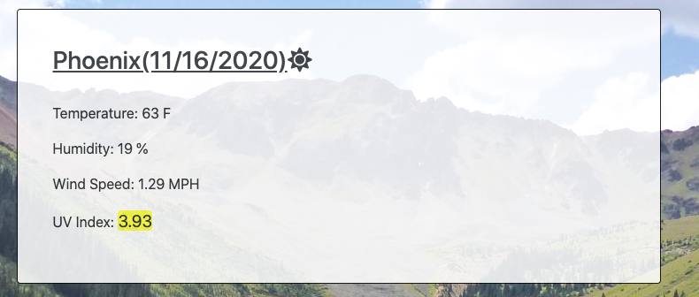
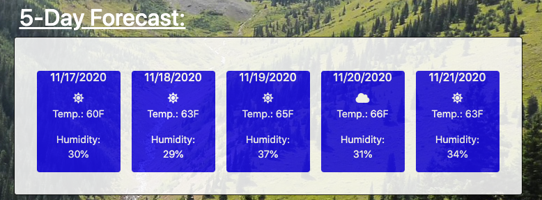
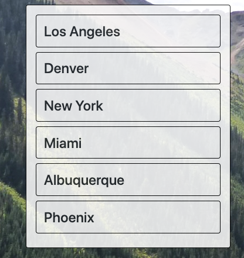
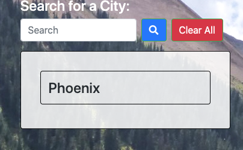
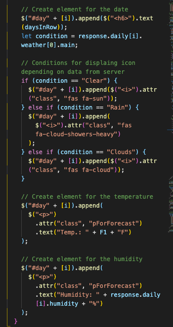

If you want to look at deployed project, click this link  https://slugovoy.github.io/Weather-Dashboard/

Otherwise you can read short guideline, presented below.

The purpose of this application is to give  user weather information based on user's input.

### Here is an example of page with some information based on user's input.

When user clicks on "Search" button, app will display the current weather conditions in that city, including temperature, humidity, UV index, and a picture representing whether it is clear, cloudy, raining, etc.

 Also, a 5-day forecast for that city is displayed below the current conditions showing similar information.

 

 Every time a user searches for a city, app adds the name of the city underneath the search menu. 
 
 
 
 
 
 When the user clicks on the city's name in history box, a new search is executed for that location.
 
 
  Also, if the user closes the window or refreshes the browser, city's names in the search history remain, and the app will open up with weather results for the last city the user searched for.
  
  
  
  
  
   And, when user  clicks the "Clear All" button, it clears the user's local storage and removes the city's names from search history.

   

   Here you can see the block of code, that responsible for checking weather conditions in provided data and displaying icon according to it.

   

   ## *Technologies, languages, frameworks been used:*

1. Javascript - used to dynamically change html and store user-input.
2. HTML - used to create elements on the DOM.
3. CSS - used for styling html elements on page.
4. Query - Used for event listeners of elements as well as to store and recall varibles in local storage to be displayed dynamically in HTML on the page.
5. Bootstrap - used for creating resposive structure and styling for this app.
6. Local storage - used to keep the variables and their values.

   ## *License*

The MIT License (MIT)

Copyright (c) 2020 Sergey Lugovoy

Permission is hereby granted, free of charge, to any person obtaining a copy of this software and associated documentation files (the "Software"), to deal in the Software without restriction, including without limitation the rights to use, copy, modify, merge, publish, distribute, sublicense, and/or sell copies of the Software, and to permit persons to whom the Software is furnished to do so, subject to the following conditions:

The above copyright notice and this permission notice shall be included in all copies or substantial portions of the Software.

THE SOFTWARE IS PROVIDED "AS IS", WITHOUT WARRANTY OF ANY KIND, EXPRESS OR IMPLIED, INCLUDING BUT NOT LIMITED TO THE WARRANTIES OF MERCHANTABILITY, FITNESS FOR A PARTICULAR PURPOSE AND NONINFRINGEMENT. IN NO EVENT SHALL THE AUTHORS OR COPYRIGHT HOLDERS BE LIABLE FOR ANY CLAIM, DAMAGES OR OTHER LIABILITY, WHETHER IN AN ACTION OF CONTRACT, TORT OR OTHERWISE, ARISING FROM, OUT OF OR IN CONNECTION WITH THE SOFTWARE OR THE USE OR OTHER DEALINGS IN THE SOFTWARE.

## *My contacts:*
1. Email serg.lugovoy.81@gmail.com
2. Phone - +1(954)303-3692

