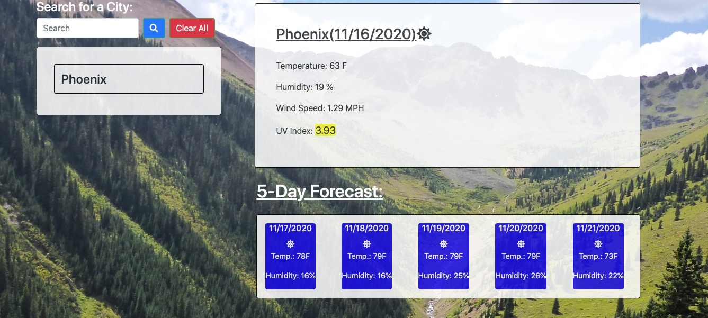
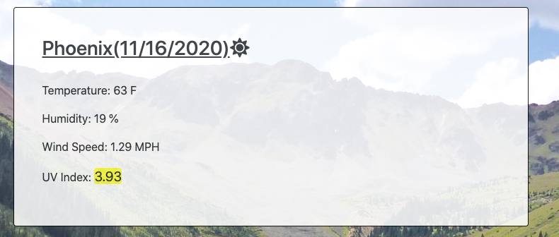
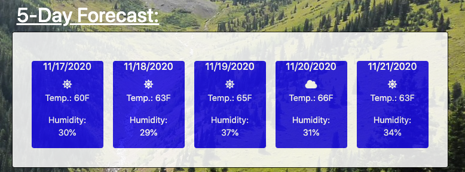
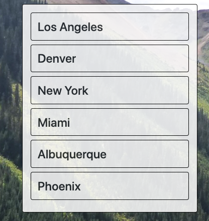
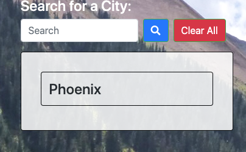
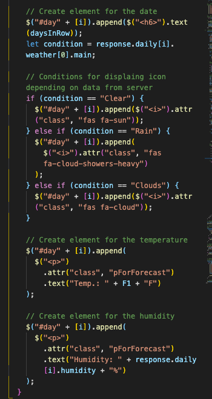

If you want to look at deployed project, click this link  https://slugovoy.github.io/Weather-Dashboard/

Otherwise you can read short guideline, presented below.

The purpose of this application is to give  user weather information based on user's input.

### Here is an example of page with some information based on user's input.

When user clicks on "Search" button, app will display the current weather conditions in that city, including temperature, humidity, UV index, and a picture representing whether it is clear, cloudy, raining, etc.

 Also, a 5-day forecast for that city is displayed below the current conditions showing similar information.

 

 Every time a user searches for a city, app adds the name of the city underneath the search menu. 
 
 
 
 
 
 When the user clicks on the city's name in history box, a new search is executed for that location.
 
 
  Also, if the user closes the window or refreshes the browser, city's names in the search history remain, and the app will open up with weather results for the last city the user searched for.
  
  
  
  
  
   And, when user  clicks the "Clear All" button, it clears the user's local storage and removes the city's names from search history.

   

   Here you can see the block of code, that responsible for checking weather conditions in provided data and displaying icon according to it.

   

